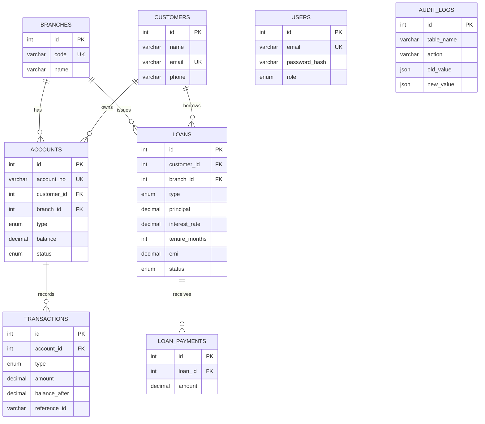

# BankDB — Bank Management System

A bank management system built to demonstrate core **DBMS concepts** end to
end: normalized schema design, ACID transactions with row locking, stored
procedures, triggers, views, and indexing — behind a clean React interface
used by bank staff.

| Layer    | Tech                                        |
|----------|---------------------------------------------|
| Database | MySQL (raw SQL via `mysql2` — no ORM)        |
| API      | Node.js + Express, JWT auth                  |
| Frontend | React 18 + Vite, Tailwind CSS, Lucide icons  |

## DBMS concepts → where they live

| Concept | Implementation |
|---------|----------------|
| 3NF schema, ER design | [server/db/schema.sql](server/db/schema.sql) — 8 tables, FKs with `ON DELETE RESTRICT`, `CHECK` constraints, `UNIQUE` keys |
| ACID transactions + row locking | `transfer_money` procedure: `SELECT ... FOR UPDATE` with deterministic lock ordering (lower account id first) to prevent deadlock — [server/db/procedures.sql](server/db/procedures.sql) |
| Application-level transactions | Deposit/withdraw in [transactionController.js](server/src/controllers/transactionController.js) use explicit `beginTransaction` / `commit` / `rollback` |
| Stored procedures | `transfer_money`, `process_loan_payment`, `apply_monthly_interest` (cursor-based) |
| Triggers | Audit logging + negative-balance safety net — [server/db/triggers.sql](server/db/triggers.sql). `audit_logs` is written **only** by triggers |
| Views | `account_statements`, `branch_summary`, `loan_outstanding` — [server/db/views.sql](server/db/views.sql) |
| Indexing | Composite `(account_id, created_at)` index; measured with `EXPLAIN ANALYZE` on 50k rows — [docs/indexing-explain.md](docs/indexing-explain.md) |
| Concurrency proof | `npm run test:concurrency` fires 10 simultaneous transfers at one account; exactly the affordable 5 succeed, balance never goes negative — [server/scripts/concurrencyTest.js](server/scripts/concurrencyTest.js) |

## ER diagram



## Running locally

Prerequisite: MySQL running on `127.0.0.1:3306` (user `root`, empty password
by default — adjust `server/.env` otherwise).

> On this machine MySQL is installed locally in `~/.local/mysql` (no
> Homebrew). Manage it with `server/scripts/mysql-server.sh {start|stop|status}`.

```bash
# 1. Database
cd server
npm install
npm run db:setup       # create schema, procedures, triggers, views
npm run db:seed        # sample data + staff logins

# 2. API (port 5002)
npm run dev

# 3. Frontend (port 5173, proxies /api to 5002)
cd ../client
npm install
npm run dev
```

Log in with **admin@bank.com / admin123** (or teller@bank.com / teller123).

## App pages

- **Dashboard** — summary cards, recent transactions, quick actions
- **Customers** — searchable table, add/edit/delete (FK-protected) modals
- **Accounts** — account list, open-account form with initial deposit
- **Transactions** — deposit / withdraw / transfer, filterable history
- **Loans** — apply with live EMI preview, repayment progress, pay EMI
- **Admin** — branch summary (view-backed), loan approval queue, audit trail

## Things to try (demo script)

1. Transfer between two accounts, then open **Admin → Audit Logs**: the
   balance changes were recorded by a database trigger, not application code.
2. Try deleting a customer who has accounts — blocked by `ON DELETE RESTRICT`.
3. Transfer more than an account's balance — rejected inside the stored
   procedure with `SIGNAL`, transaction rolled back.
4. Run `npm run test:concurrency` in `server/` — proof that row locking
   prevents lost updates and negative balances.
